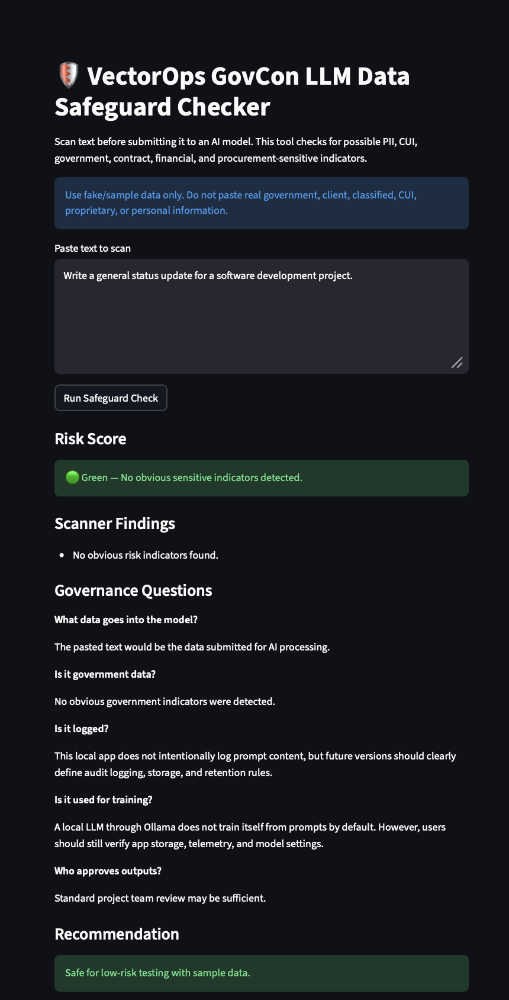
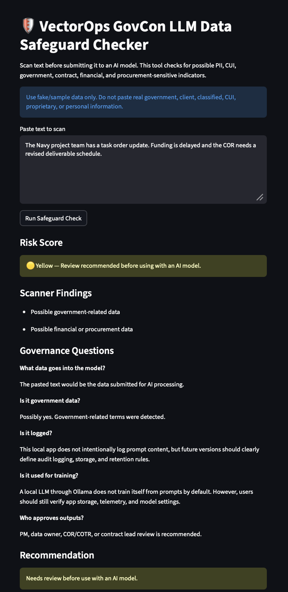
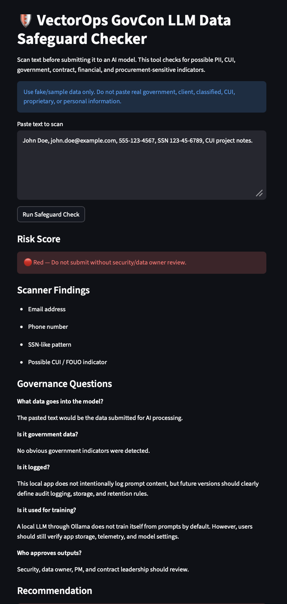

# VectorOps GovCon LLM Data Safeguard Checker

A local LLM-powered AI governance tool for government contractors, project teams, and technical program managers.

This application helps users assess whether prompt data may contain sensitive government, procurement, contract, financial, or personally identifiable information before submitting it to an AI model.

## Purpose

Government contractors are increasingly adopting AI tools, but many teams lack a simple way to evaluate whether data is appropriate to use with an LLM. This project provides a lightweight safeguard workflow that helps answer key AI governance questions:

* What data is going into the model?
* Is it government-related data?
* Does it contain possible CUI, FOUO, PII, financial, or procurement-sensitive information?
* Is the data logged?
* Is the data used for training?
* Who should approve the AI-generated output?

## Key Features

* Local LLM analysis using Ollama
* No external OpenAI API required
* Prompt risk scanning
* PII pattern detection
* Government and procurement keyword detection
* CUI and FOUO indicator detection
* Risk ratings: Green, Yellow, Red
* AI governance recommendation report
* Designed for DevSecOps and responsible AI portfolio demonstration

## Technology Stack

* Python 3.12
* Streamlit
* MCP Python SDK
* Ollama
* Local LLMs such as Llama 3 or Qwen
* Pytest
* Ruff
* Bandit
* pip-audit

## Risk Rating Logic

| Rating | Meaning                                                              |
| ------ | -------------------------------------------------------------------- |
| Green  | No obvious sensitive indicators detected                             |
| Yellow | Possible government, financial, or procurement-related data detected |
| Red    | Possible PII, CUI, FOUO, or highly sensitive indicators detected     |

## Example Use Case

A project manager wants to paste a project update into an AI tool. Before doing so, they run the text through this safeguard checker. The tool scans the prompt, identifies potential risk indicators, and generates a governance recommendation.

## MCP Server

This project also exposes the same safeguard scanner as a local MCP server so compatible AI tools and custom agents can call it before using prompt content.

### Tool

| Tool | Purpose |
| ---- | ------- |
| `scan_govcon_prompt` | Scans prompt text and returns the same structured risk results as the Streamlit app |

The tool returns JSON-compatible fields including `risk_score`, boolean risk indicators, and a `findings` list.

### Run Locally

Install dependencies:

```bash
python -m pip install -r requirements.txt
```

Start the MCP server over stdio:

```bash
python mcp_server.py
```

Example result shape:

```json
{
  "possible_pii": false,
  "possible_contract_number": true,
  "possible_government_data": true,
  "possible_cui": false,
  "possible_financial_data": false,
  "risk_score": "Yellow",
  "findings": [
    "Possible contract or document identifier",
    "Possible government-related data"
  ]
}
```

### Example MCP Client Configuration

Add a local stdio server entry in an MCP-compatible client:

```json
{
  "mcpServers": {
    "vectorops-govcon-safeguard": {
      "command": "python",
      "args": [
        "/absolute/path/to/vectorops-govcon-llm-safeguard/mcp_server.py"
      ]
    }
  }
}
```

Replace the path with the location of this repository on your machine.

## Local Quality Checks

Run the same checks used by the GitHub Actions pipeline:

```bash
python -m pytest
ruff check .
bandit -r . -x ./venv,./tests
pip-audit -r requirements.txt --no-deps --disable-pip
```

## Security Note

This project is for portfolio and educational purposes. It does not replace official security, legal, contracting, or data governance review. Do not upload real government, classified, CUI, proprietary, client, or production data into this repository.

## Future Enhancements

* File upload scanning for Word, PDF, Excel, and PowerPoint
* Automatic redaction
* Approval workflow
* Audit logging
* Docker deployment
* Azure DevOps CI/CD pipeline
* Trivy container scanning
* Checkov infrastructure scanning
* Role-based access control
* Policy-based model selection

## Portfolio Summary

Built a local LLM-powered AI governance safeguard checker using Python, Streamlit, and Ollama. The application scans prompts for possible government data, CUI indicators, PII, contract identifiers, and procurement-sensitive content before generating an AI risk recommendation. The project demonstrates secure AI adoption, DevSecOps thinking, and responsible AI governance for government contracting environments.

## Screenshots


### Green Risk Result


### Yellow Risk Result


### Red Risk Result

