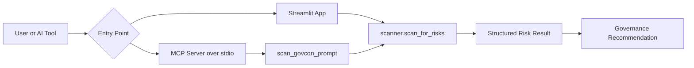

# Architecture

VectorOps GovCon LLM Safeguard Checker has two local entry points over the same rule-based scanner:

* `app.py` provides a Streamlit user interface for people reviewing prompt text manually.
* `mcp_server.py` exposes the scanner as an MCP tool for AI assistants, IDE agents, and custom automation.

Both entry points call `scanner.scan_for_risks`, which returns a JSON-compatible dictionary containing risk flags, a Green/Yellow/Red rating, and human-readable findings.

## Runtime Flow

## MCP Integration Flow

1. An MCP-compatible AI tool starts `python mcp_server.py` over stdio.
2. The client discovers the `scan_govcon_prompt` tool.
3. The AI tool sends prompt text to the tool before using it with a model.
4. The server runs the local scanner and returns structured JSON-compatible results.
5. The AI tool uses the rating and findings to advise the user according to governance rules.

## Quality Gates

GitHub Actions runs the local quality pipeline on push and pull request:

* `python -m pytest`
* `ruff check .`
* `bandit -r . -x ./venv,./tests`
* `pip-audit -r requirements.txt --no-deps --disable-pip`
